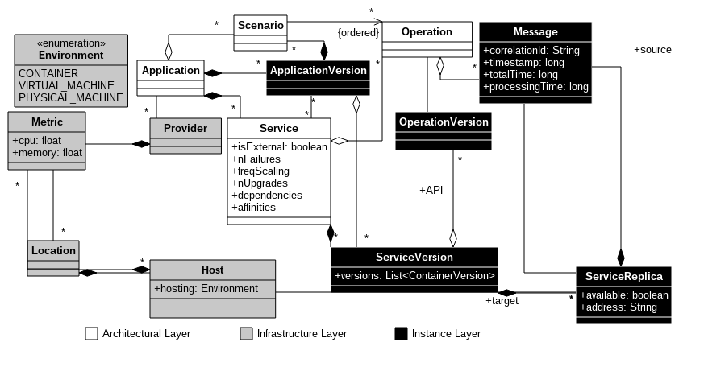

# Description

Microservices are a popular method to design scalable cloud-based
applications. Microservice-based applications (μApps) rely on message
passing for communication and to decouple each microservice, allowing
the logic in each service to scale independently. Complex μApps can
contain hundreds of microservices, complicating the ability of DevOps
engineers to reason about and automatically optimize the deployment.
In particular, the performance and resource utilization of a μApp
depends on the placement of the microservices that compose it.
However, existing tools for μApps, like Kubernetes, provide minimal
ability to influence the placement and utilization of a μApp
deployment. In this paper, we first identify the runtime aspects of
microservice execution that impact the placement of microservices in a
μApp. We then review the challenges of reconfiguring a μApp based on
these aspects. Our main contribution is an adaptation mechanism, named
REMaP, to manage the placement of microservices in an μApp
automatically. To achieve this, REMaP uses microservice affinities and
resource usage history. We evaluate our REMaP prototype and
demonstrate that our solution is autonomic, lowers resource
utilization, and can substantially improve μApp performance.

More in [Improving microservice-based applications with runtime placement adaptation](https://jisajournal.springeropen.com/articles/10.1186/s13174-019-0104-0)

## Automatic model generation of Microservice-based applications

---

Microservices have become a popular pattern for deploying scale-out application
logic and are used by companies like Netflix, IBM, and Google. An advantage of
using microservices is their loose coupling, which leads to agile and rapid
evolution, and continuous re-deployment. However, developers are tasked with
managing this evolution and largely do so manually by continuously collecting
and evaluating low-level service behaviors.

To help the developers in the management of microservices, we are developing a
mechanism to collect data from the microservices-based applications and create
an evolution model both automatically.

---

## Goals

This project has been developed to collect automatically information from
applications running on [Kubernetes](https://kubernetes.io) and populate the
proposed [model](model.png). Once running, the model is causally connected with
the applications, allowing that changes on model reflect on the application and
vice versa.

## Current Status
The project is at an early stage of development. The model is partially
constructed (only the architectural layer and parts of the instance layer).
Moreover, the mechanism is only able to collect some specific data from the
infrastructure. For example, metrics collected from
[Heapster](https://github.com/kubernetes/heapster) and stored into
[InfluxDB](https://docs.influxdata.com/influxdb/v0.8/), and application messages
collected and stored by [Zipkin](http://zipkin.io).

The next steps are to finish the mechanism to create a full instance of the
model and to carry out the causal connection between the model and the
applications.

## Future Work

As the future work, we will use this mechanism as the core of an adaptation
manager. It will able to detect particular situations of the microservice
applications and apply changes to improve their behavior at runtime. This
adaptation process should be automatically and only guided by the model. The
first use case that we envision is to adapt microservices applications to
improve their performance by changing its microservices displacement in a
cluster.

# Final remarks

It is a Ph.D. project and is in constantly changes.
